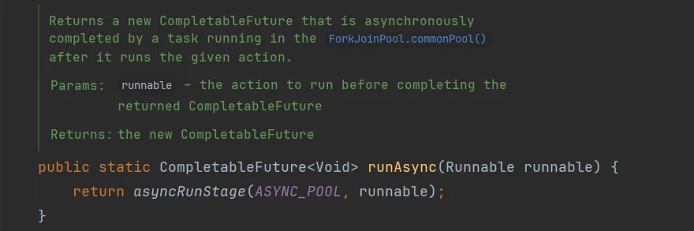
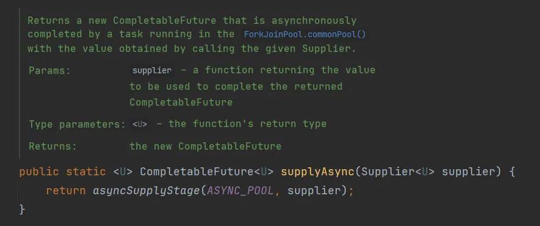

## 创建异步任务
#### runAsync
如果你要异步运行某些耗时的后台任务，并且不想从任务中返回任何内容，则可以使用CompletableFuture.runAsync()方法。它接受一个Runnable接口的实现类对象，方法返回

CompletableFuture<Void>对象。



```java
package _02_completablefuture_create;

import utils.CommonUtils;

import java.util.concurrent.CompletableFuture;

public class RunAsyncDemo {
    public static void main(String[] args) {
        // runAsync 创建异步任务
        CommonUtils.printThreadLog("main线程启动");
        // 使用Runnable匿名内部类
        CompletableFuture.runAsync(new Runnable() {
            @Override
            public void run() {
                // 模拟读取文件
                CommonUtils.printThreadLog("读取文件开始");
                // 模拟读取文件耗时3秒钟
                CommonUtils.sleepSeconds(3);
                CommonUtils.printThreadLog("读取文件结束");
            }
        });

        CommonUtils.printThreadLog("这里非阻塞，主线程继续执行");
        CommonUtils.sleepSeconds(4); // 此处休眠是为了等待CompletableFuture背后的线程执行完成。
        CommonUtils.printThreadLog("主线程结束");

        /**
         * CompletableFuture中的异步任务底层通过开启线程的方式完成的
         */
    }
}

```

我们也可以以lambda的形式传递Runnable接口实现类对象

```java
package _02_completablefuture_create;

import utils.CommonUtils;

import java.util.concurrent.CompletableFuture;

public class RunAsyncDemo02 {
    public static void main(String[] args) {
        // runAsync 创建异步任务
        CommonUtils.printThreadLog("主线程启动");
        // 使用Lambda表达式
        CompletableFuture.runAsync(() -> {
            // 模拟读取文件
            CommonUtils.printThreadLog("读取文件开始");
            // 模拟读取文件耗时3秒钟
            CommonUtils.sleepSeconds(3);
            CommonUtils.printThreadLog("读取文件结束");
        });

        CommonUtils.printThreadLog("这里非阻塞，主线程继续执行");
        CommonUtils.sleepSeconds(4); // 此处休眠是为了等待CompletableFuture背后的线程执行完成。
        CommonUtils.printThreadLog("主线程结束");

    }
}

```


需求：使用CompletableFuture开启异步任务读取news.txt文件中的新闻稿并打印输出

```java
package _02_completablefuture_create;

import utils.CommonUtils;

import java.util.concurrent.CompletableFuture;

public class RunAsyncDemo03 {
    public static void main(String[] args) {
        // 使用CompletableFuture开启异步任务读取news.txt文件中的新闻稿并打印输出
        // runAsync 创建异步任务
        CommonUtils.printThreadLog("主线程启动");
        // 使用Lambda表达式
        CompletableFuture.runAsync(() -> {
            CommonUtils.printThreadLog("读取文件");
            System.out.println(CommonUtils.readFile("news.txt"));
        });

        CommonUtils.printThreadLog("这里非阻塞，主线程继续执行");
        CommonUtils.sleepSeconds(4); // 此处休眠是为了等待CompletableFuture背后的线程执行完成。
        CommonUtils.printThreadLog("主线程结束");
    }
}

```

#### supplyAsync
CompletableFuture.runAsync()开启不带返回结果异步任务。但是，如果我想从后台的异步任务中返回一个结果怎么办，此时，CompletableFuture.supplyAsync()是你最好的选择。



它入参一个Supplier<U>提供者，用于提供带返回值的异步任务，并返回CompletableFuture<U>，其中U是提供者给程序供给值的类型

需求：开启异步任务读取news.txt，返回文件中内容并在主线程打印输出

```java
package _02_completablefuture_create;

import utils.CommonUtils;

import java.util.concurrent.CompletableFuture;
import java.util.concurrent.ExecutionException;
import java.util.function.Supplier;

public class SupplyAsyncDemo {
    public static void main(String[] args) throws ExecutionException, InterruptedException {
        CommonUtils.printThreadLog("主线程开始");
        CompletableFuture<String> newsFuture = CompletableFuture.supplyAsync(new Supplier<String>() {
            @Override
            public String get() {
                String content = CommonUtils.readFile("news.txt");
                return content;
            }
        });

        CommonUtils.printThreadLog("这里非阻塞，主线程继续执行");
        // 阻塞并等待newsFuture完成
        String news = newsFuture.get();
        System.out.println("news: " + news);
        CommonUtils.printThreadLog("主线程结束");
    }
}
```

如果想要获取newsFuture结果，可以调用newsFuture.get()方法，get方法将阻塞，直到newsFuture完成。

我们依然可以使用Java8的Lambda表达式是上面代码更简洁。

```java
package _02_completablefuture_create;

import utils.CommonUtils;

import java.util.concurrent.CompletableFuture;
import java.util.concurrent.ExecutionException;

public class SupplyAsyncDemo02 {
    public static void main(String[] args) throws ExecutionException, InterruptedException {
        CommonUtils.printThreadLog("主线程开始");
        // 使用Lambda表达式
        CompletableFuture<String> newsFuture = CompletableFuture.supplyAsync(() -> {
            return CommonUtils.readFile("news.txt");
        });

        CommonUtils.printThreadLog("这里非阻塞，主线程继续执行");
        // 阻塞并等待newsFuture完成
        String news = newsFuture.get();
        System.out.println("news: " + news);
        CommonUtils.printThreadLog("主线程结束");
    }
}

```

#### 异步任务中的线程池
大家已经知道，runAsync()和supplyAsync()方法都是单独开启线程执行异步任务。但是，我们从未创建线程。

CompletableFuture会从ForkJoinPool.commonPool()线程池获取线程来执行这些任务。`**<font style="color:rgb(64, 64, 64);background-color:rgb(236, 236, 236);">ForkJoinPool.commonPool()</font>**`**<font style="color:rgb(64, 64, 64);"> 是 JDK 自带的线程池</font>**<font style="color:rgb(64, 64, 64);">，从 </font>**<font style="color:rgb(64, 64, 64);">Java 7</font>**<font style="color:rgb(64, 64, 64);"> 开始引入（作为 </font>`**<font style="color:rgb(64, 64, 64);background-color:rgb(236, 236, 236);">Fork/Join</font>**`<font style="color:rgb(64, 64, 64);"> 框架的核心部分），并在 </font>**<font style="color:rgb(64, 64, 64);">Java 8</font>**<font style="color:rgb(64, 64, 64);"> 中被 </font>`**<font style="color:rgb(64, 64, 64);background-color:rgb(236, 236, 236);">CompletableFuture</font>**`<font style="color:rgb(64, 64, 64);"> 等异步 API 默认使用。</font>

当然，你也可以创建一个线程池，并将其传递给async()和supplyAsync()方法，以使它们从指定的线程池中获取线程执行任务。

CompletableFuture API中的所有方法都有两种变体，一种是接受传入的Executor参数作为指定的线程池，而另一种使用默认的线程池ForkJoinPool.commonPool()。

```java
// runAsync()的重载方法
static CompletableFuture<Void> runAsync(Runnable runnable);
static CompletableFuture<Void> runAsync(Runnable runnable, Executor executor);

// supplyAsync()的重载方法
static <U> CompletableFuture<U> supplyAsync(Supplier<U> supplier);
static <U> CompletableFuture<U> supplyAsync(Supplier<U> supplier, Executor executor)

```

需求：指定线程池，开启异步任务读取news.txt中的新闻稿，返回文件中内容并在主线程打印输出

```java
package _02_completablefuture_create;

import utils.CommonUtils;

import java.util.concurrent.*;

public class SupplyAsyncDemo03 {
    private static ExecutorService executor = new ThreadPoolExecutor(
            3,
            5,
            10,
            TimeUnit.SECONDS,
            new LinkedBlockingQueue<>(10)) {
    };

    public static void main(String[] args) {
        try {
            CommonUtils.printThreadLog("主线程开始");
            // 使用Lambda表达式
            CompletableFuture<String> newsFuture = CompletableFuture.supplyAsync(() -> {
                CommonUtils.printThreadLog("开始读取文件");
                String content = CommonUtils.readFile("news.txt");
                CommonUtils.printThreadLog("读取文件结束");
                System.out.println("异步线程是否为守护线程：" + Thread.currentThread().isDaemon());
                return content;
            }, executor);

            CommonUtils.printThreadLog("这里非阻塞，主线程继续执行");
            // 阻塞并等待newsFuture完成
            String news = newsFuture.get();
            System.out.println("news: " + news);
            CommonUtils.printThreadLog("主线程结束");
        } catch (Exception e) {
            e.printStackTrace();
        } finally {
            executor.shutdown();
        }
    }
}

```

最佳实践：创建属于自己的业务线程池

如果所有CompletableFuture共享一个线程池，如果有异步任务执行一些很慢的I/O操作，就会导致线程池中所有线程都阻塞再I/O上，从而造成线程饥饿，进而影响整个系统的性能。所以，可以根据不同的业务类型创建不同的线程池，以避免相互干扰。

此外：当使用JDK默认线程池时，开辟的线程默认全部为守护线程，而使用自定义的线程池时，线程的状态是继承与创建它的父类线程的状态，如上述自定义线程池有main线程创建，main线程是非守护线程，所以自定义线程池中的线程是非守护线程。

使用自定义线程池：非守护线程


不传入Executor，使用ForkJoinPool.commonPool()线程池中线程：守护线程


