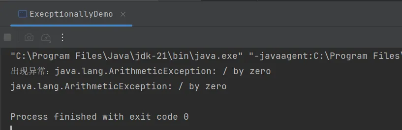
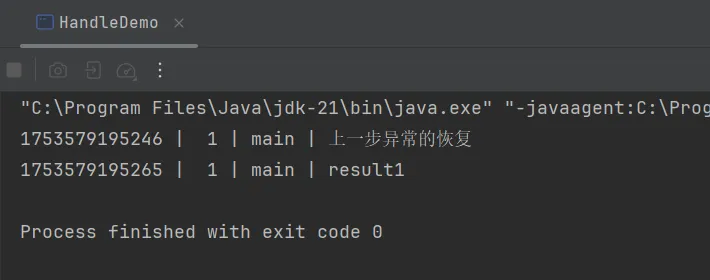
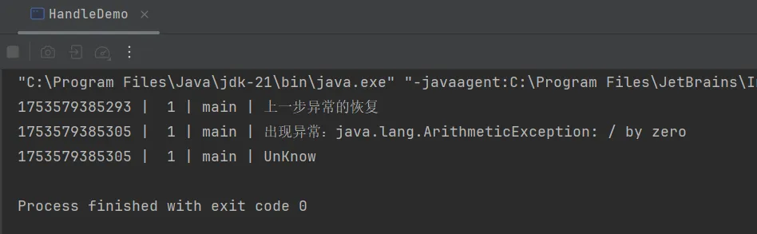

## 异步任务的异常处理

前面章节中，我们并没有关注异常处理的问题。其实，CompletableFuture提供了优化处理异常的方式。

首先，我们了解异常如何在回调链中传播

```java
package _05_completable_execption;

import utils.CommonUtils;

import java.util.concurrent.CompletableFuture;

public class ExecptionChainDemo {
    public static void main(String[] args) {
        // 异常如何在回调链中传播
        CompletableFuture<Void> future = CompletableFuture.supplyAsync(() -> {
            return "result1";
        }).thenApply(result -> {
            return result + " result2";
        }).thenApply(result -> {
            return result + " result3";
        }).thenAccept(result -> {
            CommonUtils.printThreadLog(result);     // 控制台输出结果 result1 result2 result3
        });

        CompletableFuture<Void> future2 = CompletableFuture.supplyAsync(() -> {
           // int i = 1/0;    // 此行出现异常，后续的return，thenApply，thenAccept都不会调用执行，CompletableFuture转入异常处理，所以此方法什么也没有返回
            return "result1";
        }).thenApply(result -> {
            CommonUtils.printThreadLog(result);
            int i = 10/0;
            return result + " result2";
        }).thenApply(result -> {
            return result + " result3";
        }).thenAccept(result -> {
            CommonUtils.printThreadLog(result);
        });
    }
}

```

如果在supplyAsync任务中出现异常，后续的thenApply和thenAccept回调都不会执行，CompletableFuture将转入异常处理。如果在第一个thenApply任务中出现异常，第二个thenApply和最后的thenAccept回调都不会执行，CompletableFuture将转入异常处理，依次类推。

#### execptionally();

execptionally用于处理回调链上的异常，回调链上出现任何异常，回调链不会继续向下执行，都在execptionally中处理异常

```java
CompletableFuture<R> execptionally(Function<Throwable,R> func)
```

```java
package _05_completable_execption;


import java.util.concurrent.CompletableFuture;
import java.util.concurrent.ExecutionException;

public class ExecptionallyDemo {
    public static void main(String[] args) throws ExecutionException, InterruptedException {
        CompletableFuture<String> future = CompletableFuture.supplyAsync(() -> {
            int i = 1 / 0;
            return "result1";
        }).thenApply(result -> {
            //String str = null;
            //str.length();
            return result + " result2";
        }).thenApply(result -> {
            return result + " result3";
        }).exceptionally(ex -> {
            System.out.println("出现异常：" + ex.getMessage());
            return ex.getMessage();
        });
        System.out.println(future.get());
    }
}

```

  

因为execptionally只处理一次异常，所以常常用在回调链的末端

#### handle()

CompletableFuture还提供了一种更通用的方法handle()表示从异常中恢复

handle()常常被用来恢复调用链中的一次特定的异常，调用链恢复后可以进一步向下传递。

```java
CompletableFuture<R> handle(BiFunction<T,Throwable, R> fn)
```

```java
package _05_completable_execption;

import utils.CommonUtils;

import java.util.concurrent.CompletableFuture;
import java.util.concurrent.ExecutionException;

public class HandleDemo {
    public static void main(String[] args) throws ExecutionException, InterruptedException {
        CompletableFuture<String> future = CompletableFuture.supplyAsync(() -> {
            //int i = 1 / 0;
            return "result1";
        }).handle((result, ex) -> {
            CommonUtils.printThreadLog("上一步异常的恢复");
            if (ex != null) {
                CommonUtils.printThreadLog("出现异常：" + ex.getMessage());
                return "UnKnow";
            }
            return result;
        });
        String result = future.get();
        CommonUtils.printThreadLog(result);
    }
}
```

首先，我们将int i = 1/0注释掉，执行观察结果



如果发生异常，则result参数将为null，否则ex参数将为null。

我们发现，当没有异常发生时，handle方法也会执行的，因为没有异常，ex为null，所以最后通过代码第19行将上一步的结果返回给我们，打印出"result1"。

下面，我们将int i =1/0的注释去掉，执行并观察结果



我们发现，调用链中出现异常，handle中ex不为null，控制台按我们的要求打印了异常信息，我们还对上一步执行指定了一个恢复“UnKnow”，此时“UnKnow”就在回调链上传播，我们最后调用get方法就在控制台打印了“UnKnow”字段。

需求：对回调链中的一次异常进行恢复处理

```java
package _05_completable_execption;

import java.util.concurrent.CompletableFuture;

public class HandleDemo2 {
    public static void main(String[] args) {
        // 需求：对回调链中的一次异常进行恢复处理
        CompletableFuture.supplyAsync(() -> {
                    int i = 1 / 0;
                    return "result1";
                }).handle((result, ex) -> {
                    if (ex != null) {
                        System.out.println("出现异常：" + ex.getMessage());
                        return "UnKnow1";
                    }
                    return result;
                }).thenApply(result -> {
                    String str = null;
                    str.length();
                    return result + " result2";
                }).handle((result, ex) -> {
                    if (ex != null) {
                        System.out.println("出现异常" + ex.getMessage());
                        return " UnKnow2";
                    }
                    return result;
                })
                .thenApply(result -> {
                    return result + " result3";
                }).thenAccept(result -> {
                    System.out.println(result);
                });
    }
}

```

和以往一样，为了提升并行化，异常处理可以放在单独的线程执行，以下是他们的异步回调版本
```java
CompletableFuture<R> execptionally<Function<Throwable, R> fn>
CompletableFuture<R> execptionallyAsync<Function<Throwable, R> fn>	// jdk17+
CompletableFuture<R> execptionallyAsync<Function<Throwable, R> fn, Executor executor>	// jdk17+

CompletableFuture<R> handle<BiFunction<T,Throwable,R> fn>
CompletableFuture<R> handleAsync<BiFunction<T,Throwable,R> fn>
CompletableFuture<R> handleAsync<BiFunction<T,Throwable,R> fn, Executor executor>
```
